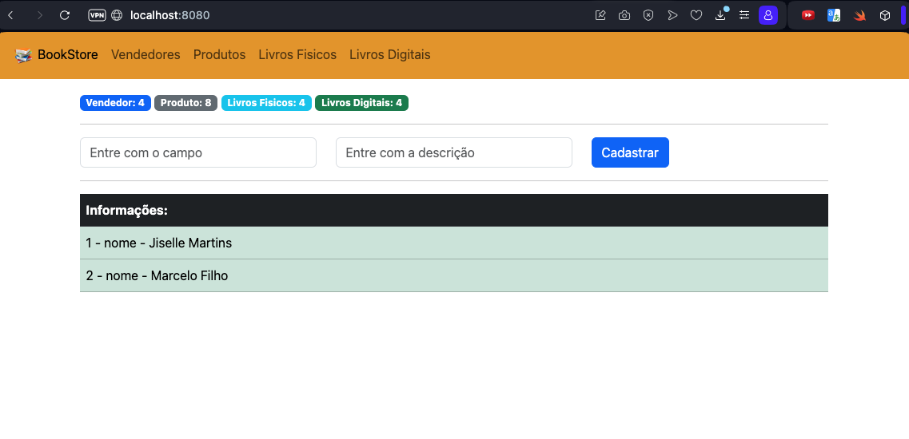
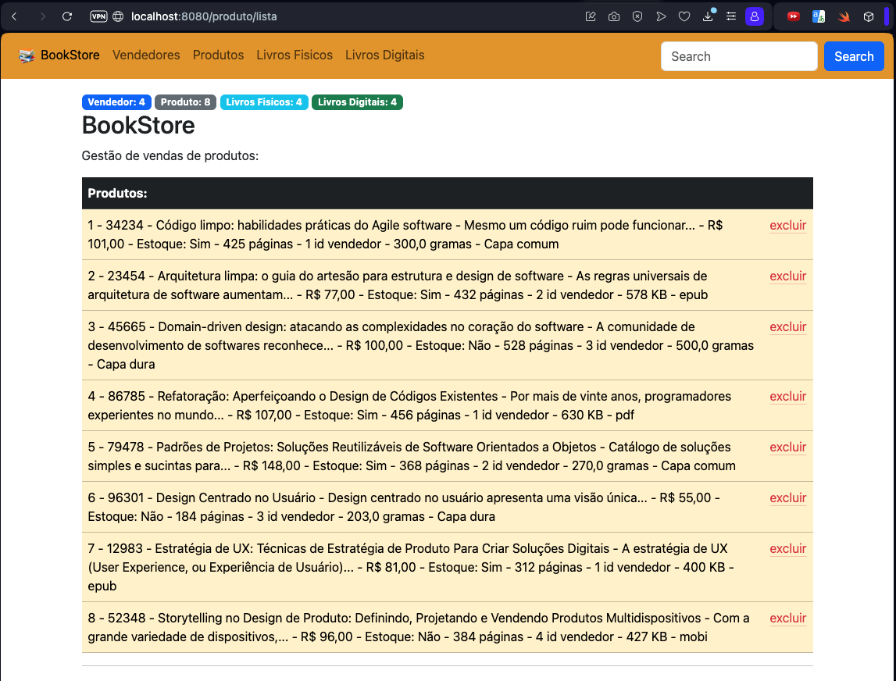

# BookStore

### Projeto para implementar uma loja de vendas de livros fisicos e digitais
### Tecnologias utilizadas:
- Java
- Spring Boot
- Hibernate ORM
- JSP
- MySQL
- Padrão MVC

O projeto BookStore foi pensado de uma forma que fizesse relação também com uma API, o projeto faz o seguinte fluxo: existe alguns arquivos dentro da pasta files que seguem um padrão, eles são lidos pela aplicação, são guardados em um bancos de dados MySQL e são exibidos na tela em formato de tabela, ainda nessa tabela é possível fazer a exclusão dos dados, essa ação é refletida também no banco de dados. Nas categorias de livros fisicos e livros digitais mostrados no menu de navegação, são exibidos apenas os produtos referentes aquela categoria, mas ao filtrar por produtos, ambas categorias são listadas juntas já que livros fisicos e digitais possuem uma herança direta de produtos. Além disso também é possivel buscar dados especificos através do campo "Search" disposto em cada tela, vendedores são buscados por CPF e produtos por código. Por fim, a integração com a API também tem uma comunicação com o banco de dados, onde o usuário através de dois campos faz a inserção de dois valores, esse valores são salvos em uma tabela e imediatamente é feito uma consulta onde esse dados são exibidos na tela. 

### Passo a Passo para executar o projeto e a API

<ins>Lembrando que o projeto e a API precisam ser executados juntos para funcionar corretamente.</ins>

[BookStore API](https://github.com/jisellevms/BookStoreAPI)

Faça o clone dos dois projetos, a BookStoreAPI e BookStore, após isso ao fazer todas as importações necessárias, será necessário rodar primeiro o projeto da API, que roda na porta 8081, e em paralelo, após a execução com sucesso, será necessário roda o projeto BookStore que roda na porta 8080. 

#### O resultado será esse:

  &nbsp; &nbsp;

